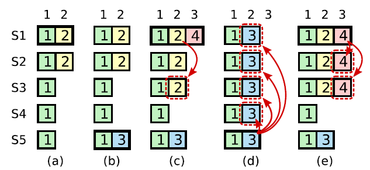
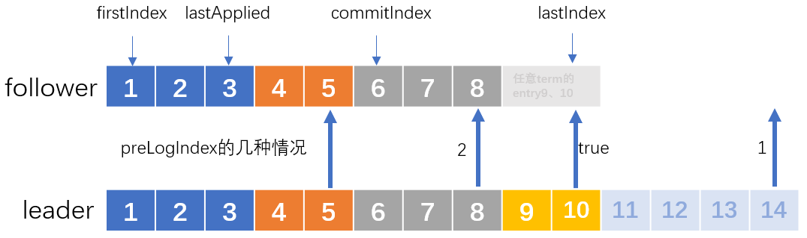

Lab 1:

Lab 2:

- [x] 2A
- [x] 2B
- [x] 2C
- [x] 2D

Lab 3:

- [x] 2A
- [x] 2B

---


# Lab 2

## 参考

1. [[译] [论文] Raft 共识算法（及 etcd/raft 源码解析）（USENIX, 2014）](http://arthurchiao.art/blog/raft-paper-zh/)
2. [一文搞懂Raft算法](https://www.cnblogs.com/xybaby/p/10124083.html)：里边对限制5.4.2讲解是非常到位的
3. https://raft.github.io/：动画
4. [OneSizeFitsQuorum/MIT6.824-2021](https://github.com/OneSizeFitsQuorum/MIT6.824-2021)
5. [yzongyue/6.824-golabs-2020](https://github.com/yzongyue/6.824-golabs-2020)

## Tips

### 理解5.4 safety

#### 5.4.1 选举限制：满足“==至少不落后==”语义

简单来说，要成为Leader，便必须包含所有已提交的entry。关键是对比自己的**lastEntry**和RequestVoteArgs中给出的：

>Raft determines which of two logs is more up-to-date by comparing the index and term of the last entries in the logs. If the logs have last entries with different terms, then **the log with the later term is more up-to-date**. If the logs end with the **same term**, then whichever **log is longer is more up-to-date**.

```go
lastEntry := rf.log.lastEntry()
lastIndex, lastTerm := lastEntry.Index, lastEntry.Term
if lastTerm > args.LastLogTerm || (lastTerm == args.LastLogTerm && lastIndex > args.LastLogIndex) {
   reply.VoteGranted, reply.Term = false, rf.currentTerm
   reply.Message = Format("不满足$5.4.1   lastEntry(%v,%v) args.last(%v,%v)",
      lastIndex, lastTerm, args.LastLogIndex, args.LastLogTerm)
   return
}
```

#### 5.4.2 提交限制：当前Term+过半提交



[这篇文章](https://www.cnblogs.com/xybaby/p/10124083.html#_label_7)对这个部分讲解不错。关键是理解论文中的figure 8（上图）。简单来说，Leader只能commit自己任期的entry，往届任期的entry只能在当前任期的entry提交时**顺便**被提交。这个限制是为了避免上图(c)和(d)的现象：(c)中S1将往届的entry(2)给replicate到大多数节点，按理来说多半便可以被提交，然而在(d)中却被entry(3)被覆盖了。

```go
func (rf *Raft) updateCommitIndex() {
   // 实现5.4.2 : raft never commit log entries from previous term by counting replicates.
   N := rf.log.lastEntry().Index
   firstIndex := rf.log.firstEntry().Index
   //如果存在 N 满足 N > commitIndex，matchIndex[i] ≥ N 对大部分 i 成立、log[N].term == currentTerm：设置 commitIndex = N
   for rf.log.entries[N-firstIndex].Term == rf.currentTerm { // 2.满足5.4.2约束
      count := 1
      for peer := range rf.peers {
         // 1.自己不会参与count计算，初始化的时候就默认算进去了(count := 1)
         // 3.更新
         if peer != rf.me && rf.matchIndex[peer] >= N {
            count++
         }
      }
      if count > len(rf.peers)/2 {
         rf.commitIndex = N
         go func() {
            rf.notifyApplyCh <- rf.commitIndex
         }()
         return
      }
      N--
   }
}
```

### 使用labrpc

调用`AppendEntries()`或`RequestVote()`这两个RPC时：
```go
rf.peers[peer].Call("Raft.AppendEntries", args, reply)
```
有返回值为false的情况。在`labrpc.go`文件中对`Call(...)`有这样的描述：
> // Call() returns false if the network lost the request or reply or the server is down.

但是我大致看了`Call`的源码后发现其实并没有发起真正的网络调用，而是通过通道来模拟的。接下来我注意到`labrpc.go`的最开始有这样的一个描述：

> // channel-based RPC, for 824 labs.
> // simulates a network that can lose requests, lose replies, delay messages, and entirely disconnect particular hosts.

也就是说虽然是模拟的RPC，但是把细节也给做真了？接着我看了下`Network`这个结构体中的属性，发现了`longDelays`和`longReordering`。在`Network#processReq(req reqMsg)`中用到了这两个属性。可以看到代码中用这两个来模拟了两种可能出现的网络问题。`longReordering`用来`sometimes delay replies a long time`，即有reply，但是会延迟很长时间；`longDelays`模拟`simulate no reply and eventual timeout`，即模拟server出问题了，直接无法给出响应。

```go
//func (rn *Network) processReq(req reqMsg)部分代码，延迟[200,2200]ms后reply
else if longreordering == true && rand.Intn(900) < 600 {
    // delay the response for a while
    ms := 200 + rand.Intn(1+rand.Intn(2000))
    // Russ points out that this timer arrangement will decrease
    // the number of goroutines, so that the race
    // detector is less likely to get upset.
    time.AfterFunc(time.Duration(ms)*time.Millisecond, func() {
        atomic.AddInt64(&rn.bytes, int64(len(reply.reply)))
        req.replyCh <- reply
    })
}
```

```go
//func (rn *Network) processReq(req reqMsg)部分代码，可以看到在7000ms后才reply
else {
    // simulate no reply and eventual timeout.
    ms := 0
    if rn.longDelays {
        // let Raft tests check that leader doesn't send
        // RPCs synchronously.
        ms = (rand.Int() % 7000)
    } else {
        // many kv tests require the client to try each
        // server in fairly rapid succession.
        ms = (rand.Int() % 100)
    }
    time.AfterFunc(time.Duration(ms)*time.Millisecond, func() {
        req.replyCh <- replyMsg{false, nil}
    })
}
```

此外还有别的参数也在起作用，比如`reliable`、`enabled`。这也是为啥我之前发现用RPC的时候常常观察日志会返回false。我最开始的解决方案是不断重试，直到返回true：

```go
// 两个条件都得满足，有可能出现的情况是：Leader变为candidate后又立即变成了Leader，成为新一届Leader，term相应会改变。
// TestFailAgree2B会出现这样的问题，如：开始Leader(me=2,term=1)，然后leader(me=2,term=5)，后边出现了连续两次减小nextIndex，导致发送给Follower的Index直接小于了Follower的commitIndex（“击穿”了）
//于是AppendEntres()方法中会有这样的日志被打印：“【WARN】Index already committed”
for Leader == rf.state && args.Term == rf.currentTerm {
    if !rf.sendAppendEntries(peer, args, reply) {
        time.Sleep(10 * time.Millisecond)
        continue
    }
    break
}
```

当初这么做，是以为所有的RPC即使超时，也是会有reply的，但是看了`processReq`的源码后发现，这个reply可能会在7秒后才会出现🤣，那个时候不知进行了多少轮heartbeat了。后来发现这种方式缺陷不止一点，还有：如果不小心执行这个循环的上下文持有锁，在遇到“no reply”的情况下会相当长时间占有锁，这是一个很糟糕的设计。

其实看了[raft的动画](https://raft.github.io/)后会发现，一轮广播election/heartbeat的RPC是可以没有reply的，等到这轮election/heartbeat超时了(timeout)了，便不再等待上一轮的RPC。

比较好的使用姿势是通道（如下）。首先okCh是非阻塞的通道，这样下边的RPC协程有返回值写入okCh后便可以直接结束，不必阻塞。接着两个select条件分别是RPC正常返回，和RPC超时。RPC超时用到了`context.WithTimeout()`，设置的是一轮heartbeat的超时时间，当然还有一种可能，当`reply.Term > rf.currentTerm`时候也会调用`cancelFunc`，提前结束这一轮广播，并切换成follower。

这里有个细节，RPC超时情况发生，用一个协程来接收okCh，这是借鉴了`labrpc.go`中的代码，原因注释上写清除了。还有一个原因是，`close(okCh)`中的文档：

> …, and has the effect of shutting down the channel **after the last sent value is received**. 

```go
okCh := make(chan bool, 1) //非阻塞通道
go func() { //RPC协程
    okCh <- rf.peers[peer].Call("Raft.AppendEntries", args, reply)
    close(okCh) //It should be executed only by the sender, never the receiver
}()
//借鉴labrpc.go 251行
select {
    case ok := <-okCh: //RPC正常返回
        if !ok {
            return
        }
    case <-ctx.Done(): //RPC超时
        go func() {
            <-okCh // drain channel to let the goroutine created earlier terminate
        }()
    return
}
```


### 为什么Go中没有重入锁？

其实我并没有得到完美的答案。我看了一下Russ那个[帖子](https://groups.google.com/g/golang-nuts/c/XqW1qcuZgKg/m/Ui3nQkeLV80J)下边的评论，感觉依旧众说纷纭，但这篇回复倒是有点意思：[链接](http://link.zhihu.com/?target=https%3A//groups.google.com/g/golang-nuts/c/XqW1qcuZgKg/m/tYq8frpidd8J)。

> A mutex represents a contract, not an enforcement. But as long as everyone follows the contract, then it is in force.

这篇回复的最后他也并不确定他的结论，并他选择相信Russ，因为他更有经验。

另外一个[帖子](https://groups.google.com/g/golang-nuts/c/XqW1qcuZgKg/m/cuTpMGzKOaAJ)也有类似的观点，我认为这是目前最make sense的回答。总结起来，invariant与是否是可重入锁无关。

> I think I am kind of getting where you are coming from.
> But in my view your argument is incorrect. **A mutex can never enforce invariants in the code**; it is meant to protect access to a data item by ensuring only one thread has access to it. **And this invariant is preserved whether the mutex is reentrant or not.**（与可重入锁无关）
>
> If a mutex is not released properly then the function that fails to do this is not preserving an invariant that is in its contract - but this has nothing to do with the mutex type.
>
> Regards


### entries[0]的两个用处

首先，Index是从1开始曾增长，所以一般用一个空的entry来占位`entries[0]`，这样Index==1的entry在entries中的下标也是1；

更大的用处是在Lab 2D，来自[Lab 2D](https://pdos.csail.mit.edu/6.824/labs/lab-raft.html)的第7个hint（如下）。将lastIncluded Index&Term给持久化到entries[0]中。

> Even when the log is trimmed, your implemention still needs to properly send the term and index of the entry prior to new entries in `AppendEntries` RPCs; **this may require saving and referencing the latest snapshot's** `lastIncludedTerm/lastIncludedIndex` (**consider whether this should be persisted**).


### 通道的使用经验

send/receive通道的上下文尽量不要占有锁，否则会极大影响并发效率，甚至造成死锁，尤其是阻塞通道。

[Go 最细节篇 — chan 为啥没有判断 close 的接口 ?](https://jishuin.proginn.com/p/763bfbd31949)


## 代码实现

说几个比较重要或者对我来说实现比较困难的代码思路。

### AppendEntries RPC

实现这个方法需要考虑的corner case太多了，我几乎花了一周的时间来实现。按照Figure 2来实现，我画了个图来说明需要处理的几种情况。




### sendAppendEntries

比较“创新”的地方是用到了递归，因为这个方法在调用AppendEntries RPC之前，**会检查目标follower的nextIndex是否catch up了leader的firstIndex**：`rf.nextIndex[peer] <= rf.log.firstEntry().Index`。如果没有，便需要进行一轮InstallSnapshot。

用这种递归的好处是，可以在一轮broadcast heartbeat中向一个follower发出多次RPC，可以尽量在一轮heartbeat中完成InstallSnapshot、AppendEntries，让follower能够完全和leader同步


## Issues

###### Q：为啥不持久化commitIndex和LastApplied？

我在这里提了个issue，[链接](https://github.com/yzongyue/6.824-golabs-2020/issues/9)


# Lab 3

### 2A

目前Lab 3A的要求似乎是最基本的，首先不要求实现读一致性，但是也需要解决下边的问题：

> However, with no additional measures, this would run the risk of returning stale data, since the leader responding to the request might have been superseded by a newer leader of which it is unaware.
>
> 一个进行reply的leader可能已经被新的leader给取代了，而不自知

目前的做法是，reply之前判断一下目前还是否是leader：

```go
if currentTerm, isLeader := kv.rf.GetState(); isLeader && currentTerm == applyMsg.CommandTerm {
    kv.notifyChanMap[commandIndex] <- reply
}
```

其次，每个client都只是串行的，于是server只用为每个client保持一个session，这篇文章：

[raft在处理用户请求超时的时候，如何避免重试的请求被多次应用？](https://www.zhihu.com/question/278551592/answer/400962941)

提到的做法是一个client可以concurrent进行请求的处理方式，在OngaroPHD的$6.3中也提到了：

> This approach also generalizes to allow concurrent requests from a single client. Instead of the client’s session tracking just the client’s **latest sequence number** and response, it includes a set of sequence number and response pairs. With each request, the client includes the **lowest sequence number for which it has not yet received a response**, and the state machine then discards all responses for lower sequence numbers.

concurrent情况下，每一个request需要带上最大已经收到的序列号，或者如原文中说的尚未收到response的最小序列号。


TestSpeed3A会超时，报错：

> test_test.go:421: Operations completed too slowly 129ms/op > 33.333333ms/op（大致是这个时间，忘截图了）

这个时间其实差不多和设置的一轮heartbeat的时间相近。也就是说每次调用`Start()`后并不会马上去同步，而是等待下一轮heartbeat才会同步，实际上应该在收到entry后立即广播。但这虽然大大提高了可用性（2.3s就过了，官方给的时间15.7），但似乎更好的做法是应该累计一定的entry后再广播，比如等待30ms。

这个问题我耗费了很长时间进行处理，如果是收到entry后立即广播，那么将会产生巨量的AppendEntries RPC，这显然是不可行的。然后我将心跳超时时间设置成了21ms，这个测试点能够通过，但是引发的问题是Lab 2B中的TestCount2B又过不了了：

> test_test.go:677: too many RPCs (64) for 1 second of idleness

现在知道的思路是，每一轮AppendEntries RPC结束后，如果有新的entries加入，便**立即**进行下一轮，换句话说，同一时刻只存在一轮AppendEntries RPC，这样应该就可以同时解决上边的两个报错。

至于如何实现暂时还没有很好的思路，倒是看了下[这里](https://github.com/OneSizeFitsQuorum/MIT6.824-2021/blob/master/docs/lab2.md#%E5%A4%8D%E5%88%B6%E6%A8%A1%E5%9E%8B)的实现，用到了condition，我在想能不能直接使用通道来实现？

### 2B

这部分我觉得思路不是很复杂，但是花费了我很长很长的时间，找bug那段时间（大概整整一周）我一度准备放弃。最后大概是老天垂怜，让我无意间发现了在Lab 2期间忽视的一个点：`applier()`中有这么一行：

```go
rf.lastApplied = Max(rf.lastApplied, rf.commitIndex)
```

意思是更新`lastApplied`，显然是要加写锁的，但是我当时实现的时候不知咋滴，加的是读锁😭！这导致了我跑test的时候老是fail，出现一些奇奇怪怪的问题。

这部分的实现思路总结一下，分为安装snapshot和持久化snapshot。

安装snapshot有两个地方：一是来自leader的，也就是被调用InstallSnapshot RPC，其次是本地server reboot，对应的方法是`raft#readSnapshot(...)`。这两个方法流程大同小异，本质都是raft层truncate entries，然后将snapshot**通过通道**（`rf.applyCh`）提交给server层，让server 层自己安装snapshot。也就是说，server层安装snapshot都是通过`applyCh`通道，在server层收到消息之前是能确保raft层已经对entries truncate完毕了。

持久化snapshot的过程类似上边的过程倒过来：先server持久化（`kv.snapshot(...)`），然后让raft层truncate entries，最后持久化raft state。
