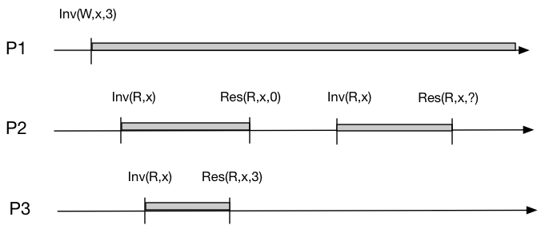

Lab 1:

Lab 2:

- [x] 2A
- [x] 2B
- [x] 2C
- [x] 2D

Lab 3:

- [x] 2A
- [x] 2B

---


# Lab 2

参考资料：

1. [[译] [论文] Raft 共识算法（及 etcd/raft 源码解析）（USENIX, 2014）](http://arthurchiao.art/blog/raft-paper-zh/)
2. [一文搞懂Raft算法](https://www.cnblogs.com/xybaby/p/10124083.html)：里边对限制5.4.2讲解是非常到位的
3. https://raft.github.io/：动画

## 理解5.4 safety

#### 5.4.1 选举限制：满足“==至少不落后==”语义

简单来说，要成为Leader，便必须包含所有已提交的entry。关键是对比自己的**lastEntry**和RequestVoteArgs中给出的：

>Raft determines which of two logs is more up-to-date by comparing the index and term of the last entries in the logs. If the logs have last entries with different terms, then **the log with the later term is more up-to-date**. If the logs end with the **same term**, then whichever **log is longer is more up-to-date**.

```go
lastEntry := rf.log.lastEntry()
lastIndex, lastTerm := lastEntry.Index, lastEntry.Term
if lastTerm > args.LastLogTerm || (lastTerm == args.LastLogTerm && lastIndex > args.LastLogIndex) {
   reply.VoteGranted, reply.Term = false, rf.currentTerm
   reply.Message = Format("不满足$5.4.1   lastEntry(%v,%v) args.last(%v,%v)",
      lastIndex, lastTerm, args.LastLogIndex, args.LastLogTerm)
   return
}
```

这里再简单提及一下在cluster membership changes也有一个选举限制，为了避免被移除节点的干扰（三个问题之一），只有在节点选举超时（即成为candidate时） 的时候，才会处理RequestVote RPC，否则忽略此RPC。这是为了避免被移除节点（不在C~new~中的节点）的干扰。

#### 5.4.2 提交限制：当前Term+过半提交（figure 8典中典）


[这篇文章](https://www.cnblogs.com/xybaby/p/10124083.html#_label_7)对这个部分讲解不错。关键是理解论文中的figure 8（上图）。简单来说，Leader只能commit自己任期的entry，往届任期的entry只能在当前任期的entry提交时==**顺便**==被提交。这个限制是为了避免上图(c)和(d)的现象：(c)中S1将往届的entry(2)给replicate到大多数节点，按理来说过半便可以被提交，然而在(d)中却被entry(3)被覆盖了。

```go
func (rf *Raft) updateCommitIndex() {
   // 实现5.4.2 : raft never commit log entries from previous term by counting replicates.
   N := rf.log.lastEntry().Index
   firstIndex := rf.log.firstEntry().Index
   //如果存在 N 满足 N > commitIndex，matchIndex[i] ≥ N 对大部分 i 成立、log[N].term == currentTerm：设置 commitIndex = N
   for rf.log.entries[N-firstIndex].Term == rf.currentTerm { // 2.满足5.4.2约束
      count := 1
      for peer := range rf.peers {
         // 1.自己不会参与count计算，初始化的时候就默认算进去了(count := 1)
         // 3.更新
         if peer != rf.me && rf.matchIndex[peer] >= N {
            count++
         }
      }
      if count > len(rf.peers)/2 {
         rf.commitIndex = N
         go func() {
            rf.notifyApplyCh <- rf.commitIndex
         }()
         return
      }
      N--
   }
}
```

## 使用labrpc

调用`AppendEntries()`或`RequestVote()`这两个RPC时：
```go
rf.peers[peer].Call("Raft.AppendEntries", args, reply)
```
有返回值为false的情况。在`labrpc.go`文件中对`Call(...)`有这样的描述：
> // Call() returns false if the network lost the request or reply or the server is down.

但是我大致看了`Call`的源码后发现其实并没有发起真正的网络调用，而是通过通道来模拟的。接下来我注意到`labrpc.go`的最开始有这样的一个描述：

> // channel-based RPC, for 824 labs.
> // simulates a network that can lose requests, lose replies, delay messages, and entirely disconnect particular hosts.

也就是说虽然是模拟的RPC，但是把细节也给做真了？接着我看了下`Network`这个结构体中的属性，发现了`longDelays`和`longReordering`。在`Network#processReq(req reqMsg)`中用到了这两个属性。可以看到代码中用这两个来模拟了两种可能出现的网络问题。`longReordering`用来`sometimes delay replies a long time`，即有reply，但是会延迟很长时间；`longDelays`模拟`simulate no reply and eventual timeout`，即模拟server出问题了，直接无法给出响应。

```go
//func (rn *Network) processReq(req reqMsg)部分代码，延迟[200,2200]ms后reply
else if longreordering == true && rand.Intn(900) < 600 {
    // delay the response for a while
    ms := 200 + rand.Intn(1+rand.Intn(2000))
    // Russ points out that this timer arrangement will decrease
    // the number of goroutines, so that the race
    // detector is less likely to get upset.
    time.AfterFunc(time.Duration(ms)*time.Millisecond, func() {
        atomic.AddInt64(&rn.bytes, int64(len(reply.reply)))
        req.replyCh <- reply
    })
}
```

```go
//func (rn *Network) processReq(req reqMsg)部分代码，可以看到在7000ms后才reply
else {
    // simulate no reply and eventual timeout.
    ms := 0
    if rn.longDelays {
        // let Raft tests check that leader doesn't send
        // RPCs synchronously.
        ms = (rand.Int() % 7000)
    } else {
        // many kv tests require the client to try each
        // server in fairly rapid succession.
        ms = (rand.Int() % 100)
    }
    time.AfterFunc(time.Duration(ms)*time.Millisecond, func() {
        req.replyCh <- replyMsg{false, nil}
    })
}
```

此外还有别的参数也在起作用，比如`reliable`、`enabled`。这也是为啥我之前发现用RPC的时候常常观察日志会返回false。我最开始的解决方案是不断重试，直到返回true：

```go
// 两个条件都得满足，有可能出现的情况是：Leader变为candidate后又立即变成了Leader，成为新一届Leader，term相应会改变。
// TestFailAgree2B会出现这样的问题，如：开始Leader(me=2,term=1)，然后leader(me=2,term=5)，后边出现了连续两次减小nextIndex，导致发送给Follower的Index直接小于了Follower的commitIndex（“击穿”了）
//于是AppendEntres()方法中会有这样的日志被打印：“【WARN】Index already committed”
for Leader == rf.state && args.Term == rf.currentTerm {
    if !rf.sendAppendEntries(peer, args, reply) {
        time.Sleep(10 * time.Millisecond)
        continue
    }
    break
}
```

当初这么做，是以为所有的RPC即使超时，也是会有reply的，但是看了`processReq`的源码后发现，这个reply可能会在7秒后才会出现🤣，那个时候不知进行了多少轮heartbeat了。后来发现这种方式缺陷不止一点，还有：如果不小心执行这个循环的上下文持有锁，在遇到“no reply”的情况下会相当长时间占有锁，这是一个很糟糕的设计。

其实看了[raft的动画](https://raft.github.io/)后会发现，一轮广播election/heartbeat的RPC是可以没有reply的，等到这轮election/heartbeat超时了(timeout)了，便不再等待上一轮的RPC。

比较好的使用姿势是通道（如下）。首先okCh是非阻塞的通道，这样下边的RPC协程有返回值写入okCh后便可以直接结束，不必阻塞。接着两个select条件分别是RPC正常返回，和RPC超时。RPC超时用到了`context.WithTimeout()`，设置的是一轮heartbeat的超时时间，当然还有一种可能，当`reply.Term > rf.currentTerm`时候也会调用`cancelFunc`，提前结束这一轮广播，并切换成follower。

这里有个细节，RPC超时情况发生，用一个协程来接收okCh，这是借鉴了`labrpc.go`中的代码，原因注释上写清除了。还有一个原因是，`close(okCh)`中的文档：

> …, and has the effect of shutting down the channel **after the last sent value is received**. 

```go
okCh := make(chan bool, 1) //非阻塞通道
go func() { //RPC协程
    okCh <- rf.peers[peer].Call("Raft.AppendEntries", args, reply)
    close(okCh) //It should be executed only by the sender, never the receiver
}()
//借鉴labrpc.go 251行
select {
    case ok := <-okCh: //RPC正常返回
        if !ok {
            return
        }
    case <-ctx.Done(): //RPC超时
        go func() {
            <-okCh // drain channel to let the goroutine created earlier terminate
        }()
    return
}
```


## 为什么Go中没有重入锁？

其实我并没有得到完美的答案。我看了一下Russ那个[帖子](https://groups.google.com/g/golang-nuts/c/XqW1qcuZgKg/m/Ui3nQkeLV80J)下边的评论，感觉依旧众说纷纭，但这篇回复倒是有点意思：[链接](http://link.zhihu.com/?target=https%3A//groups.google.com/g/golang-nuts/c/XqW1qcuZgKg/m/tYq8frpidd8J)。

> A mutex represents a contract, not an enforcement. But as long as everyone follows the contract, then it is in force.

这篇回复的最后他也并不确定他的结论，并他选择相信Russ，因为他更有经验。

另外一个[帖子](https://groups.google.com/g/golang-nuts/c/XqW1qcuZgKg/m/cuTpMGzKOaAJ)也有类似的观点，我认为这是目前最make sense的回答。总结起来，invariant与是否是可重入锁无关。

> I think I am kind of getting where you are coming from.
> But in my view your argument is incorrect. **A mutex can never enforce invariants in the code**; it is meant to protect access to a data item by ensuring only one thread has access to it. **And this invariant is preserved whether the mutex is reentrant or not.**（与可重入锁无关）
>
> If a mutex is not released properly then the function that fails to do this is not preserving an invariant that is in its contract - but this has nothing to do with the mutex type.
>
> Regards


## entries[0]的两个用处

首先，Index是从1开始曾增长，所以一般用一个空的entry来占位`entries[0]`，这样Index==1的entry在entries中的下标也是1；

更大的用处是在Lab 2D，来自[Lab 2D](https://pdos.csail.mit.edu/6.824/labs/lab-raft.html)的第7个hint（如下）。将lastIncluded Index&Term给持久化到entries[0]中。

> Even when the log is trimmed, your implemention still needs to properly send the term and index of the entry prior to new entries in `AppendEntries` RPCs; **this may require saving and referencing the latest snapshot's** `lastIncludedTerm/lastIncludedIndex` (**consider whether this should be persisted**).


## 通道的使用经验

send/receive通道的上下文尽量不要占有锁，否则会极大影响并发效率，甚至造成死锁，尤其是阻塞通道。

[Go 最细节篇 — chan 为啥没有判断 close 的接口 ?](https://jishuin.proginn.com/p/763bfbd31949)


## 代码实现

说几个比较重要或者对我来说实现比较困难的代码思路。

### AppendEntries RPC

实现这个方法需要考虑的corner case太多了，我几乎花了一周的时间来解决。按照Figure 2来实现，我画了个图来说明需要处理的几种情况。


### sendAppendEntries

比较“创新”的地方是用到了递归，因为这个方法在调用AppendEntries RPC之前，**会检查目标follower的nextIndex是否catch up了leader的firstIndex**：`rf.nextIndex[peer] <= rf.log.firstEntry().Index`。如果没有，便需要进行一轮InstallSnapshot。

用这种递归的好处是，可以在一轮broadcast heartbeat中向一个follower发出多次RPC，可以尽量在一轮heartbeat中完成InstallSnapshot、AppendEntries，让follower能够完全和leader同步


## Issues

###### Q：为啥不持久化commitIndex和LastApplied？

我在这里提了个issue，[链接](https://github.com/yzongyue/6.824-golabs-2020/issues/9)


# Lab 3

## 论文中线性==读==的实现方式

论文Client Interaction章节的线性写比较好理解，但如何避免读取**过时数据**（stale data），以实现线性读不是很理解。这里记录一下提到的两种预防措施（precaution）。

##### 预防措施一

> First, a leader must have the latest information on which entries are committed.

这是让我纠结最久的，但仔细理解后面一句话其实就明白了：

> The Leader Completeness Property guarantees that a leader has all committed entries, but at the start of its term, **it may not know which those are**.

简单来说，leader和follower更新commitIndex的方式是不同的，对于follower，直接通过AppendEntries RPC的参数leaderCommit即可更新，而leader需要通过nextIndex[]和matchIndex[]，情况要复杂些。

而在**刚**成为leader的时候确实是不知道followers commit了哪些entries，因为新leader会进行这样的初始化：

```go
for peer := range rf.peers {
    rf.nextIndex[peer] = rf.log.lastEntry().Index + 1
    rf.matchIndex[peer] = rf.log.firstEntry().Index
}
```

这并不能反映followers的真实commit情况，需要AppendEntries后才可以确认：

>1️⃣Raft handles this by having each leader commit a blank **no-op entry** into the log at the **start of its term**.

这个操作就是为了更新`[]nextIndex`和`[]matchIndex`，根据这俩来更新leader的`commitIndex`属性（具体看`raft#updateCommitIndex()`方法）。

其实，如果AppendEntries的reply中带上nextIndex参数，我倒是觉得也不需要提交一个no-op entry了，直接通过返回的nextIndex参数就能更新leader的`commitIndex`属性了。

❗❗❗描述一个如果没有此预防措施，可能导致的读一致性问题：

假设entry(25)的操作是：x:12 ➡ x:24。leader(1)接收了client(3)的entry(25)，通过AppendEntries RPC将entry(25)同步到了大部分follower，随后leader(1)将entry(25)apply了，然后回复client(3)。**在leader(1)还没有进行下一轮广播前宕机，即没有告诉follower自己的commit情况（通过leaderCommit参数）**，然后选举超时，拥有最新日志的follower(3)成为leader(3)，**这时leader(3)的commitIndex属性一定是小于25的！**如果此时client(3)立马通过这位新leader读取x，那么它将读到的是12，而不是最新的24！这便出现了一致性问题。

这玩意儿也用在了单步成员变更中有涉及，为了解决其中的[正确性问题](https://zhuanlan.zhihu.com/p/359206808)。

##### 预防措施二

> Second, a leader must check whether it has been **deposed** before processing a read-only request

这一点很好理解，解决的问题是：

>…, since the leader responding to the request might have been superseded by a newer leader of which it is unaware.（一个进行reply的leader可能已经被一个新的leader给取代，**而不自知**）

解决方案：

>2️⃣Raft handles this by having the leader exchange heartbeat messages with a majority of the cluster **before responding to read-only requests**.

线性写没有这个限制的原因，我觉得应该是即使已经不是leader了，entries发给follower之后，follower也会拒绝这个旧term的entries。但是线性读就没有这样的保障了，如果没有别的措施便不会进行网络通信，只是进行本地读取，便不会知道集群的情况：自己是否已经被取代。


## 2A

目前Lab 3A的要求似乎是最基本的，首先不要求实现读一致性，但是也需要解决下边的问题：

> However, with no additional measures, this would run the risk of returning stale data, since the leader responding to the request might have been superseded by a newer leader of which it is unaware.
>
> 一个进行reply的leader可能已经被新的leader给取代了，而不自知

目前的做法是，reply之前判断一下目前还是否是leader：

```go
if currentTerm, isLeader := kv.rf.GetState(); isLeader && currentTerm == applyMsg.CommandTerm {
    kv.notifyChanMap[commandIndex] <- reply
}
```

其次，每个client都只是串行的，于是server只用为每个client保持一个session，这篇文章：

[raft在处理用户请求超时的时候，如何避免重试的请求被多次应用？](https://www.zhihu.com/question/278551592/answer/400962941)

提到的做法是一个client可以concurrent进行请求的处理方式，在OngaroPHD的$6.3中也提到了：

> This approach also generalizes to allow concurrent requests from a single client. Instead of the client’s session tracking just the client’s **latest sequence number** and response, it includes a set of sequence number and response pairs. With each request, the client includes the **lowest sequence number for which it has not yet received a response**, and the state machine then discards all responses for lower sequence numbers.

concurrent情况下，每一个request需要带上最大已经收到的序列号，或者如原文中说的尚未收到response的最小序列号。

### 解决TestSpeed3A超时的历程

TestSpeed3A会超时，报错：

> test_test.go:421: Operations completed too slowly 129ms/op > 33.333333ms/op

这个时间其实差不多和设置的一轮heartbeat的时间相近。也就是说每次调用`Start()`后并不会马上去同步，而是等待下一轮heartbeat才会同步，这样做显然在可用性上很拉跨。实际上，应该在收到entry后立即广播，但这虽然大大提高了可用性（2.3s就过了，官方给的时间15.7s），但这会产生巨量并发的AppendEntries RPC。似乎更好的做法是应该累计一定的entry后再广播，比如等待30ms。我也这样尝试了一下，但发现了下边描述的问题。

我将心跳超时时间设置成了21ms，这个测试点能够通过，但Lab 2B中的TestCount2B又过不了了：

> test_test.go:677: too many RPCs (64) for 1 second of idleness

后来又想到一个思路：一次AppendEntries RPC结束后，如果有新的entries加入，便**立即**进行一轮AppendEntries RPC，**然后阻塞掉这个RPC**，等这次RPC完成后释放掉锁，进行下一轮RPC。也就是说，同一时刻只存在一轮AppendEntries RPC，这样应该就可以同时解决上边的两个报错。

至于如何实现暂时还没有很好的思路，倒是看了下[这里](https://github.com/OneSizeFitsQuorum/MIT6.824-2021/blob/master/docs/lab2.md#%E5%A4%8D%E5%88%B6%E6%A8%A1%E5%9E%8B)的实现，用到了condition，但我想直接用channel来实现，但还没有很好的思路。


## 2B

这部分我觉得思路不是很复杂，但是花费了我很长很长的时间，找bug那段时间（大概整整一周）我一度准备放弃。最后大概是老天垂怜，让我无意间发现了在Lab 2期间忽视的一个点：`applier()`中有这么一行：

```go
rf.lastApplied = Max(rf.lastApplied, rf.commitIndex)
```

意思是更新`lastApplied`，显然是要加写锁的，但是我当时实现的时候不知咋滴，加的是读锁😭！这导致了我跑test的时候时不时就fail，出现一些奇奇怪怪的问题。

这部分的实现思路总结一下，分为安装snapshot和持久化snapshot。

安装snapshot有两个地方：一是来自leader的，也就是被调用InstallSnapshot RPC，其次是本地server reboot，对应的方法是`raft#readSnapshot(...)`。这两个方法流程大同小异，本质都是raft层truncate entries，然后将snapshot**通过通道**（`rf.applyCh`）提交给server层，让server 层自己安装snapshot。也就是说，server层安装snapshot都是通过`applyCh`通道，在server层收到消息之前是能确保raft层已经对entries truncate完毕了。

持久化snapshot的过程类似上边的过程倒过来：先server持久化（`kv.snapshot(...)`），然后让raft层truncate entries，最后持久化raft state。


# Replication方案学习—Chain Replication &Quorum

### 外部权威—更通用的方案

> 不管怎样，配合一个**外部权威**机构这种架构，我不确定是不是万能的，但的确是非常的通用。（来自[6.824翻译](https://mit-public-courses-cn-translatio.gitbook.io/mit6-824/lecture-09-more-replication-craq/9.7-lian-fu-zhi-de-pei-zhi-guan-li-qi-configuration-manager)）

> 从集群的分布式模式来看，往往分布式的中心化存储，**其监控模式都推荐隔离开业务数据处理，形成独立管理者或者状态监控者**，例如：分布式文件系统HDFS的namenode、zookeeper**、**journalnode；MongoDB副本集模式中的仲裁；RocketMQ的nameserver；以及Redis的哨兵。（来自[知乎回答](https://www.zhihu.com/question/449535048/answer/1782590778)）

### Chain Replication & CRAQ

CRAQ和Chain Replication的区别感觉不是太大，CRAQ应该是提供了多版本的读，让复制链上所有的节点都可以处理读请求。


### Quorum


# Client Interaction学习—Zookeeper

Raft主要解决的问题是fault tolerance，本身是不提供high performance的，甚至会恶化：follower只是愉快地执行leader交给的任务。

Zookeeper作为Raft(准确来说是ZAB)之上的server，是为了能够提供high performance，基于一个事实：现实世界中，读请求是远多余写请求。

提供了两个一致性保证：

### Linearizable Write

> 这里的意思是，尽管客户端可以并发的发送写请求，然后Zookeeper表现的就像以某种顺序，一次只执行一个写请求，并且也符合写请求的**实际时间**（total order）。

### FIFO Client Order（管道机制）—保证读的顺序一致性

这点比较难理解。我认为这是一种顺序一致性保证：虽然在client内部是并行的，但是发送给server的时候是串行的：请求以特定的顺序到达server（偏序）。非常类似HTTP1/1的管道机制！

我猜测这里应该类似我raft中的实现，每一个请求发送时，都会携带下边的元组：`SequenceNum`，以递增的顺序发送给server。

```go
ClientId int64
SequenceNum int64
```

这还不是重点，管道机制只是顺序一致性保障的第一步，难点在于：Leader负责写，副本负责读。这会带来下边的问题：

假设client1先后（编程序/偏序）发送了两个请求：W~x,1~、R~x~，要保证W~x,1~的结果堆对R~x~可见。

对此，Zookeeper对副本进行了约束：==client需要记住**最高zxid**，且请求时会带上。副本在没有获取到该zxid之前，不可响应client的（读）请求。==

> 学生提问：zxid必须要等到写请求执行完成才返回吗？
>
> Robert教授：实际上，我不知道它具体怎么工作，但是这是个合理的假设。当我发送了异步的写请求，系统并没有执行这些请求，但是系统会回复我说，好的，我收到了你的写请求，**==如果==它最后commit了**，这将会是对应的zxid。所以这里是一个合理的假设，我实际上不知道这里怎么工作。之后如果客户端执行读请求，就可以告诉一个副本说，这个zxid是我之前发送的一个写请求。

### 实现线性一致读—`sync()`

非常有意思的实现，我觉得这是用了实现顺序一致性的方式来实现读的线性一致：“没有同步到该zxid前，不可响应”🤣。


# Membership Changes

参考：[Raft成员变更的工程实践](https://zhuanlan.zhihu.com/p/359206808)、[Raft 成员变更的相关问题-沧海月明](https://www.inlighting.org/archives/raft-membership-change)

虽然lab中没有涉及这个部分，但我还是看了一下相关理论，发现还是有些难懂，我看了一些资料后说说我的理解：

首先“成员变更”不仅指增加节点，还包括删除、更换节点等。于是对C~old,new~的理解就非常重要了：同时使用新旧配置文件，也就是新／旧节点的**并集**。举个例子，可能C~old~={1,2,3},C~new~={2,4,5}，也就是同时出现了删除(1)、新增(5)、替换(3➡4，描述可能不准确)三种情况，这个时候C~old,new~={1,2,3,4,5}。

1️⃣相比于单步成员变更，我觉得Joint Consensus（也叫两阶段式）更接近本质。重点应该是对拥有C~old,new~节点的约束：**在leader宕机，开启新一轮投票时，C~old,new~节点需要C~old~和C~new~分别的多数派==都==投票了才能成为新的leader**。而只拥有C~old~的节点没有这样的约束（也不可能有这样的约束，因为根本不知道发生了成员变更），只需要获得老配置节点(C~old~)的多数投票就能成为leader，但此时也意味着成员变更失败了，需要重头开始。这也很好理解，因为C~old~节点根本不知道集群进入了Joint Consensus状态。

这看起来是一种很巧妙的方式，因为我们无法控制C~old~的节点的竞选行为，但可以通过控制C~old,new~节点的行为从而避免出现两个leader的错误。

上边是C~old,new~被leader提出但还没被大多数节点apply的情况，即尚未被commit。如果C~old,new~被commit了，**表明C~old,new~已经被大多数节点apply**。如果此时leader宕机，开启新一轮投票，其中C~old~节点是不可能成为leader，依据是safety 5.4.1，于是只可能从C~old,new~中产生新leader，并且接着进行变更流程：

> Leader再向Cold和Cnew同步一条只包含Cnew的日志，此后日志只需要Cnew的多数派确认。**Cnew日志只需要在Cnew达成多数派即可提交**，此时成员变更完成，<u>不在Cnew中的成员自动下线</u>。

以上过程被称为两阶段提交。

还需要强调一点，区别于普通的entry，节点一旦收到C~old,new~，**便立即应用**，不必等到提交。

2️⃣另外一种方式是单步成员变更，这种方式天然保证C~old~和C~new~有交集。这种方式会出现的问题和解决方案见参考的文章，感觉得多看几次才能够自己复述出来。

目前觉得万恶之源是b节点，虽然它在term 1成为了d的follower，但是它既没有收到C~v~，也没有收到E，**导致始终没有更新log**，使得在a重新竞选时，b不会根据safety限制（5.4.1，“至少部落后语义”）来拒绝a的RequestVote，最后让a如愿以偿当上leader，然后把之前提交的C~v~给覆盖了，出现了类似论文中Figure 8描述的问题。

参考文章中提到的解决方案：Leader上任后先提交一条no-op日志，是很巧妙也很简洁的。既然为了避免b(F1)给a投上一票，**那就让b的日志比a新**，这样根据“至少不落后”语义，便不会给a投票了，做法就是文中提到的，以下图为例，因为这时候d(L1)还没有接收到C~v~，于是提交no-op entry必然会让b(F1)收到。正式点的描述是：

> 这条no-op日志可以保证跟上一任Leader未提交的成员变更日志**至少有一个节点交集**。

这个解决方案用途其实很广泛，因为在server实现线性读的时候也用到了：在刚成为leader的时候同步一条no-opentry，这样就可以让这个新leader知道有哪些entry已经提交，避免读取到过时数据。


# FLP不可能定理

参考：[FLP 不可能定理介绍](https://tanxinyu.work/flp-theory/)、[FLP 不可能性原理](https://shunliz.gitbooks.io/blockchain-guide/content/distribute_system/flp.html)、[拜占庭问题与算法](https://shunliz.gitbooks.io/blockchain-guide/content/distribute_system/bft.html)

这是一个**理论上的定理**，给出的是一个下限，最极端情况，也就是**异步模型**：消息延迟无法预测（可能有限，可能无限，**无法事先得知**）。

这个模型下，不可能存在容忍**哪怕只有一个节点故障**的共识算法（consensus algorithm），不可能达成一致（consistency）。

这个定理让我惊叹的点在于，即使在绝对理想的情况下（不存在拜占庭问题，网络也是绝对可靠的），异步模型也不存在容错的共识算法。

第二篇参考文章讲得很好：

> FLP 不可能原理实际上告诉人们，**不要浪费时间去为异步分布式系统设计在任意场景下都能实现共识算法**。

这句话让我觉得，如果FLP是一个理论上、科学上的定理，那么CAP就是工程上的解决方案，把理论上的不可能，通过做一些trade off，在工程上成为可能。

工程上的实现在第一篇参考文章中有提到，比如加入<u>最大超时时间</u>，可以转换成同步模型（现实世界鲁棒性挺强的）。

> 同步网络模型（synchronous model）可以达到惊人的 100% 容错，虽然对错误节点超过 1/2 时的节点行为有限制。这里的同步模型是指网络延迟一定是有界的，即**小于某个已知的常数**。

第一篇参考文章中也提到了**部分**同步的模型，主要考虑到了类似[拜占庭将军问题](https://shunliz.gitbooks.io/blockchain-guide/content/distribute_system/bft.html)：

> 当叛变者**不超过$$\frac{1}{3}$$时**，存在有效的算法，不论叛变者如何折腾，忠诚的将军们总能达成一致的结果。


# linearizability vs sequential consistency

## 全序和偏序

总的来说，是**全序（total order）与偏序（partial order）**的区别。此观点来自于[这里](https://segmentfault.com/a/1190000022248118)。

## 线性一致性：total order

参考：[分布式系统一致性—*by YuanBao on April 21, 2018*](http://kaiyuan.me/2018/04/21/consistency-concept/)。

> Linearizability 实际上刻画了我们对于分布式系统的非常自然的期望：
>
> - 每一个读操作都将返回==『最近的写操作』==（基于单一的==实际时间==）的值
> - 系统中的所有进程，看到的操作顺序，都与全局时钟下的顺序一致

“最近的写操作”反映了线性一致性和顺序一致性最根本的区别。

顺序一致性只需要保证单个客户端的这种偏序关系。举个例子，**单个客户端A**，先后发送了两个请求：W~x,1~、R~x~，那么W~x,1~的结果对R~x~是可见的，此时满足顺序一致性。

对于线性一致性，设**两个客户端A、B**，先后（实际时间的先后）发送两个请求：W~x,1~、R~x~。

对于顺序一致性，不要求W~x,1~的结果对R~x~可见，毕竟在异步网络模型下，不能保证在实际时间先发送的请求能够比后发送的到达服务器。而在线性一致性下，必须要保证W~x,1~的结果对R~x~可见。这表示所有客户端都遵守的全序关系。

下图便描述了一个不符合线性一致的场景：在P3以及读取到x=3的情况下，**说明 P3 的读操作是在 P1 的写操作生效点之后执行**。如果 “?” 处的值为0，便不符合线性一致。



## 顺序一致性：partial order

参考：[什么是顺序一致性(Sequential Consistency)](https://lotabout.me/2019/QQA-What-is-Sequential-Consistency/)。顺序一致与CPU多级缓存，继续看此文章中的内容。

> 如果**存在**一个所有 CPU 执行指令的排序（串行），**该排序中每个 CPU 要执行指令的顺序得以保持**，且实际的 CPU 执行结果（并行）与该指令排序的执行结果一致，则称该次执行达到了顺序一致性。

上边用到的是CPU而不是线程、进程来描述的原因是，线性一致性最初并不是用在分布式场景下的，而是*shared-memory muti-processor system*。 

顺序一致性更加契合实际，以编程序为准。“编程顺序”指的是：只要满足同一进程中指令的先后顺序即可。如下图P1，(W,2)的结果能够保证先于(W,3)即可，这也就是被称为偏序的原因：进程**局部**保证一致性即可。话句话说，顺序一致性能够保证单个客户端（局部）的线性一致。

所以下边的两种情况存在一个执行顺序都能满足：`P1 x.write(2) -> P1 x.write(3) -> P2 x.write(5) -> P1 x.read(5)`。


这也是为啥我觉得线性一致性和数据库中的可串行化（Serializability）隔离级别相似的原因，看看可串行化的描述：存在一个串行的执行结果，和并行的执行结果相同。

所以我认为Lab3实际实现的应该是顺序一致，因为我目前的实现并没有对所有的client做一个全局的约束，加上在异步网络模型下无法控制请求到达service的先后顺序，只能保证client内部的偏序。
